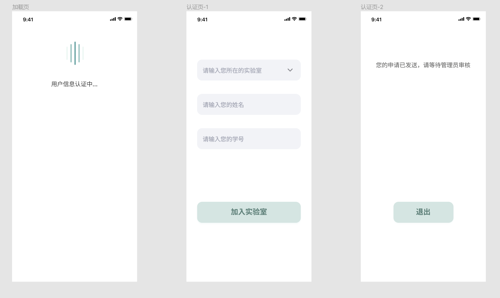
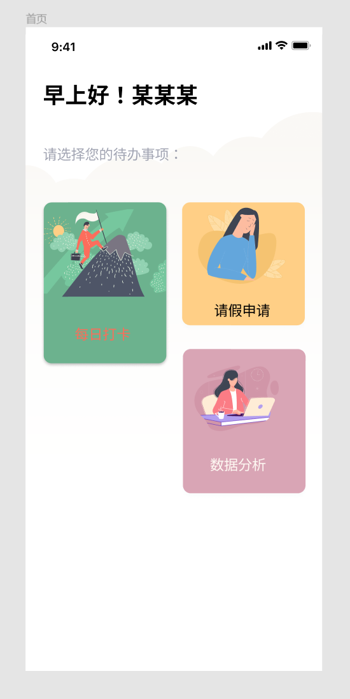
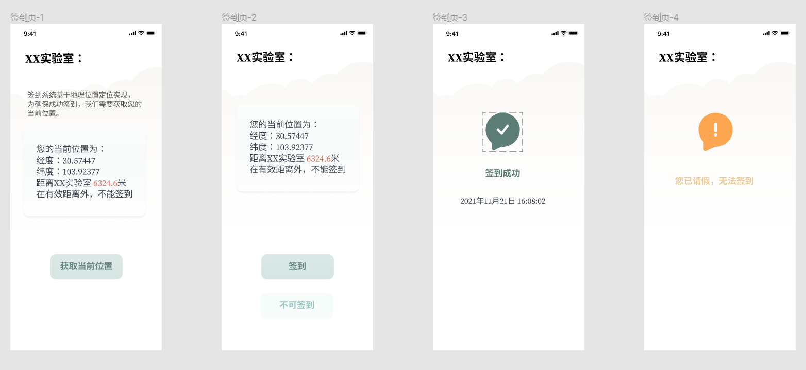
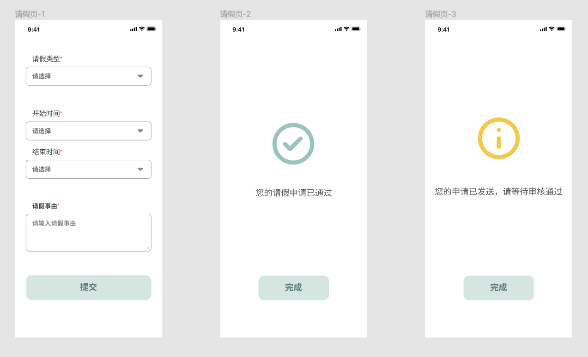
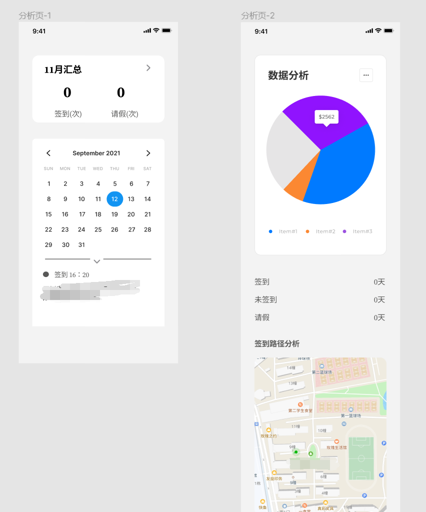

TODO:

- [ ] 认证页表单空白校验
- [x] 签到页校验能否获取地理位置，判断按钮状态
- [x] 增加实验室签到位置范围参数，动态控制页面距离显示和按钮状态
- [ ] 将 lab 信息获取提升到 index 首页
- [ ] 统一云函数返回格式
- [ ] 云函数修改为 ts+rollup 编译生成

查询用户所在的实验室
新增打卡记录（用户 openid、实验室\_id、上传时间（服务器时间）、用户端坐标（上传信息））
用户打卡记录
请假表单
请假状态信息
用户信息分析

## 页面 UI 设计

认证页面：

首页：

签到页面：

请假页面：

数据分析：

